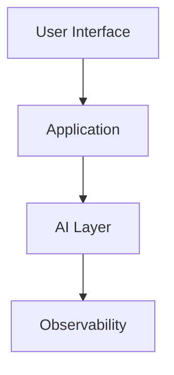
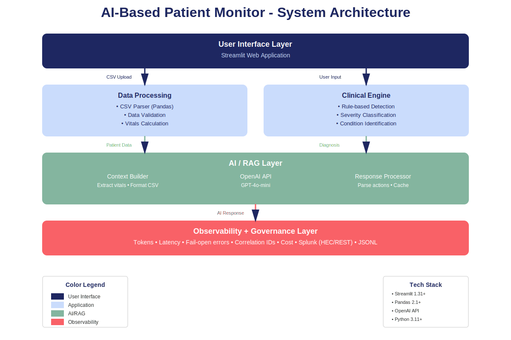

# 🏗️ AI Architecture Diagrams - Complete Guide

## 📦 What You Received

I've created **3 different formats** of architecture diagrams for your assignment:

### 1. **PowerPoint Presentation** 📊
**File:** `AI_Architecture_Diagrams.pptx`

**5 Professional Slides:**
- **Slide 1:** Title slide with project branding
- **Slide 2:** High-level system architecture (4 layers)
- **Slide 3:** Detailed data flow pipeline
- **Slide 4:** RAG (Retrieval Augmented Generation) pipeline
- **Slide 5:** Component details and technologies

**Use for:**
- Assignment submission (required Part 5)
- Presentations to class
- Printing handouts
- Professional documentation

**Color Palette:**
- Navy (#1E2761) - User Interface
- Ice Blue (#CADCFC) - Application Layer
- Sage Green (#84B59F) - AI/Success
- Coral (#F96167) - Alerts/Monitoring

---

### 2. **Mermaid Diagrams** 📝
**File:** `ARCHITECTURE_MERMAID.md`

**5 Interactive Diagrams:**
- High-level architecture (graph)
- Data flow pipeline (flowchart)
- RAG sequence diagram
- Component architecture (detailed graph)
- Emergency detection logic (decision tree)

**Use for:**
- GitHub README.md
- Documentation sites (GitBook, Confluence)
- Wiki pages
- Any markdown-based documentation

**How to use:**
Just copy the mermaid code blocks into your markdown files. GitHub will render them automatically!

---

### 3. **SVG Vector Graphic** 🎨
**File:** `AI_Architecture_Diagram.svg`

**Single Clean Diagram:**
- 4-layer architecture
- Color-coded components
- Labeled data flows
- Technology stack legend

**Use for:**
- High-quality printing
- Embedding in websites
- Scalable graphics (no pixelation)
- Professional reports

**View:**
- Open in any browser
- Edit in Adobe Illustrator, Inkscape
- Embed in HTML pages

---

## 🎯 Assignment Requirement (Part 5)

**Requirement:** AI Architecture flow diagram (5 marks)

**What to submit:**
- Use the **PowerPoint** file (most professional)
- OR export slides to PDF
- OR use the **SVG** file

**Recommendation:** Submit the PowerPoint and include the Mermaid diagrams in your README.md for bonus points!

---

## 📋 Architecture Overview

### Layer 1: User Interface
- **Technology:** Streamlit web app
- **Components:** File uploader, metrics, charts, alerts
- **Responsibility:** User interaction and data visualization

### Layer 2: Application Layer
- **Components:**
  - **Data Processing:** CSV parser (Pandas), validation, calculation
  - **Clinical Engine:** Rule-based detection, severity classification
- **Responsibility:** Business logic and condition detection

### Layer 3: AI/RAG Layer
- **Components:**
  - **Context Builder:** Extract vitals, format data
  - **OpenAI API:** GPT-4o-mini for clinical decisions
  - **Response Processor:** Parse actions, cache results
- **Responsibility:** AI-powered decision support

### Layer 4: Observability Layer
- **Components:** Token tracking, latency monitoring, error handling
- **Responsibility:** Performance metrics and reliability

---

## 🔄 Data Flow Explained

1. **Ingestion:** User uploads CSV or selects sample patient
2. **Validation:** Check required columns and data types
3. **Analysis:** Calculate vitals, compute MAP
4. **Detection:** Apply clinical rules (sepsis, V-tach, etc.)
5. **Classification:** Assign severity (NORMAL/WARNING/EMERGENCY)
6. **RAG Processing:** Build context from patient data
7. **AI Call:** Send to OpenAI API with prompt
8. **Response:** Parse nurse actions and suggestions
9. **Display:** Show results with visualizations
10. **Monitoring:** Track tokens, latency, success

---

## 🤖 RAG Pipeline Detail

### Step 1: Retrieval
- Load patient CSV file
- Extract last 60 minutes of vitals
- Format as structured data

### Step 2: Augmentation
- Combine vitals with diagnosis summary
- Add clinical flags and severity
- Build comprehensive LLM prompt

### Step 3: Generation
- Call OpenAI API (GPT-4o-mini)
- Parse AI response
- Extract actionable nurse recommendations

**Example Prompt Structure:**
```json
{
  "system": "You are an ICU clinical decision support AI...",
  "user": {
    "task": "Suggest nurse actions",
    "patient_summary": {
      "level": "EMERGENCY",
      "diagnosis": "Suspected sepsis",
      "flags": ["Fever", "Tachycardia", "Hypotension"]
    },
    "recent_vitals_csv": "timestamp,HR,BP,Temp,SpO2..."
  }
}
```

---

## 🎨 Design Choices

### Color Coding
Each layer has a distinct color to show separation of concerns:
- **Navy:** User-facing components
- **Ice Blue:** Application logic
- **Sage Green:** AI/success states
- **Coral:** Alerts and monitoring

### Visual Hierarchy
- Arrows show data flow direction
- Box sizes indicate importance
- Grouping shows related components

### Professional Aesthetic
- Medical/healthcare color palette
- Clean, minimal design
- Clear labels and legends

---

## 📊 Using the PowerPoint

### For Assignment Submission:
1. Open `AI_Architecture_Diagrams.pptx`
2. Review all 5 slides
3. Export to PDF (File → Export → Create PDF)
4. Submit PDF with your GitHub repo

### For Presentation:
- Slide 1: Introduction
- Slides 2-4: Technical walkthrough
- Slide 5: Implementation details

### Customization:
- Add your name to title slide
- Adjust colors if needed
- Add speaker notes
- Export individual slides as images

---

## 📝 Using Mermaid in GitHub

### In README.md:
```markdown
## System Architecture


```

GitHub automatically renders mermaid blocks!

### Supported Platforms:
- ✅ GitHub
- ✅ GitLab
- ✅ Azure DevOps
- ✅ Notion
- ✅ Confluence (with plugin)

---

## 🖼️ Using the SVG

### In HTML:
```html

```

### In Markdown:
```markdown

```

### Editing:
- Open in Inkscape (free)
- Open in Adobe Illustrator
- Edit text/colors as needed
- Export to PNG for presentations

---

## ✅ Assignment Checklist

For Part 5 (AI Architecture - 5 marks):

- [ ] Include PowerPoint in GitHub repo
- [ ] Add Mermaid diagram to README.md
- [ ] Reference architecture in demo video
- [ ] Explain architecture in comments/documentation

**Bonus Points:**
- [ ] Multiple diagram formats (3 provided!)
- [ ] Clear labels and legends
- [ ] Professional color scheme
- [ ] Detailed component breakdown

---

## 🎓 Grading Tips

**What professors look for:**
1. **Completeness:** All major components shown
2. **Clarity:** Easy to understand flow
3. **Labels:** Clear naming and descriptions
4. **Professional:** Clean, well-designed
5. **Accuracy:** Matches actual implementation

**Common Mistakes to Avoid:**
- ❌ Hand-drawn diagrams (use provided files!)
- ❌ Missing component labels
- ❌ Unclear data flow
- ❌ No legend/color coding
- ❌ Generic diagrams not matching your code

---

## 📚 Additional Resources

### Learn More About:
- **RAG:** https://www.anthropic.com/news/retrieval-augmented-generation
- **Mermaid:** https://mermaid.js.org/
- **System Design:** https://github.com/donnemartin/system-design-primer

### Tools Used:
- Python-pptx for PowerPoint generation
- SVG for vector graphics
- Mermaid for markdown diagrams

---

## 🔄 Diagram Comparison

| Feature | PowerPoint | Mermaid | SVG |
|---------|-----------|---------|-----|
| **Professional** | ⭐⭐⭐⭐⭐ | ⭐⭐⭐ | ⭐⭐⭐⭐ |
| **Editable** | ⭐⭐⭐⭐ | ⭐⭐⭐⭐⭐ | ⭐⭐⭐ |
| **Interactive** | ❌ | ✅ (on GitHub) | ❌ |
| **Scalable** | ⭐⭐⭐ | ⭐⭐⭐⭐⭐ | ⭐⭐⭐⭐⭐ |
| **Print Quality** | ⭐⭐⭐⭐⭐ | ⭐⭐⭐ | ⭐⭐⭐⭐⭐ |
| **GitHub** | ⭐⭐ | ⭐⭐⭐⭐⭐ | ⭐⭐⭐⭐ |

**Recommendation:** Use PowerPoint for submission, Mermaid in README, SVG for backup!

---

## 🎉 You're All Set!

You now have:
- ✅ 5-slide professional PowerPoint
- ✅ 5 Mermaid diagrams for GitHub
- ✅ 1 high-quality SVG diagram
- ✅ Complete documentation

**Next Steps:**
1. Review the PowerPoint
2. Add one Mermaid diagram to your README
3. Submit with your assignment
4. Reference in your demo video

Good luck with your assignment! 🚀


---

## 🔭 Observability + Governance (What’s New in v2)

Your implementation now goes beyond in-app metrics and adds **production-style AI observability**:

- **Correlation IDs**: `pm_session_id` and `pm_run_id` added to every event for end-to-end tracing.
- **Splunk HEC events** (optional): sends structured events such as:
  - `ai_inference` (latency, tokens, model, success/failure, estimated cost)
  - `clinical_alert` and `alert_acknowledged`
- **Local JSONL archive** (optional): writes events to `logs/events.jsonl` for offline review.
- **Splunk Management API (8089)** (optional): runs SPL searches to produce an in-app **run summary**:
  - AI calls, success rate, avg/p95 latency, token totals, estimated cost, emergency count.

**Fail-open design:** if Splunk isn’t configured, the app continues to run normally.
