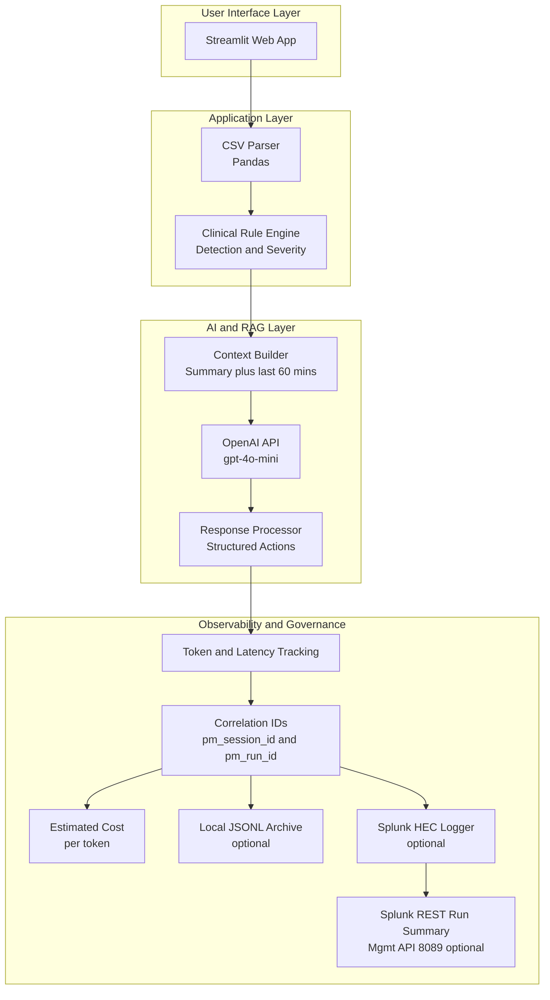
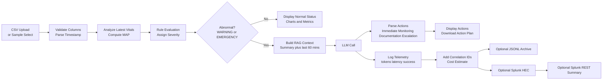
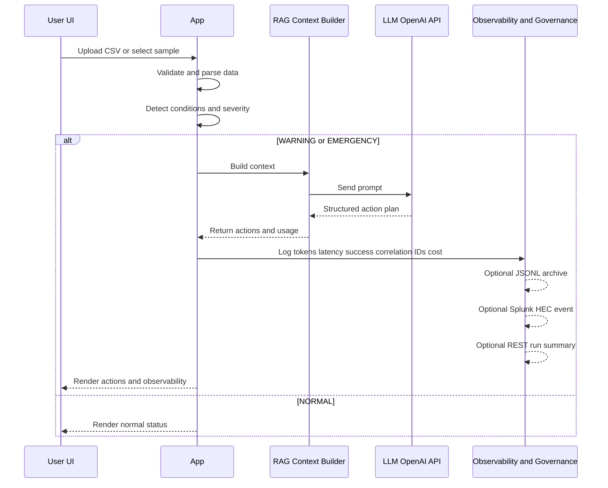
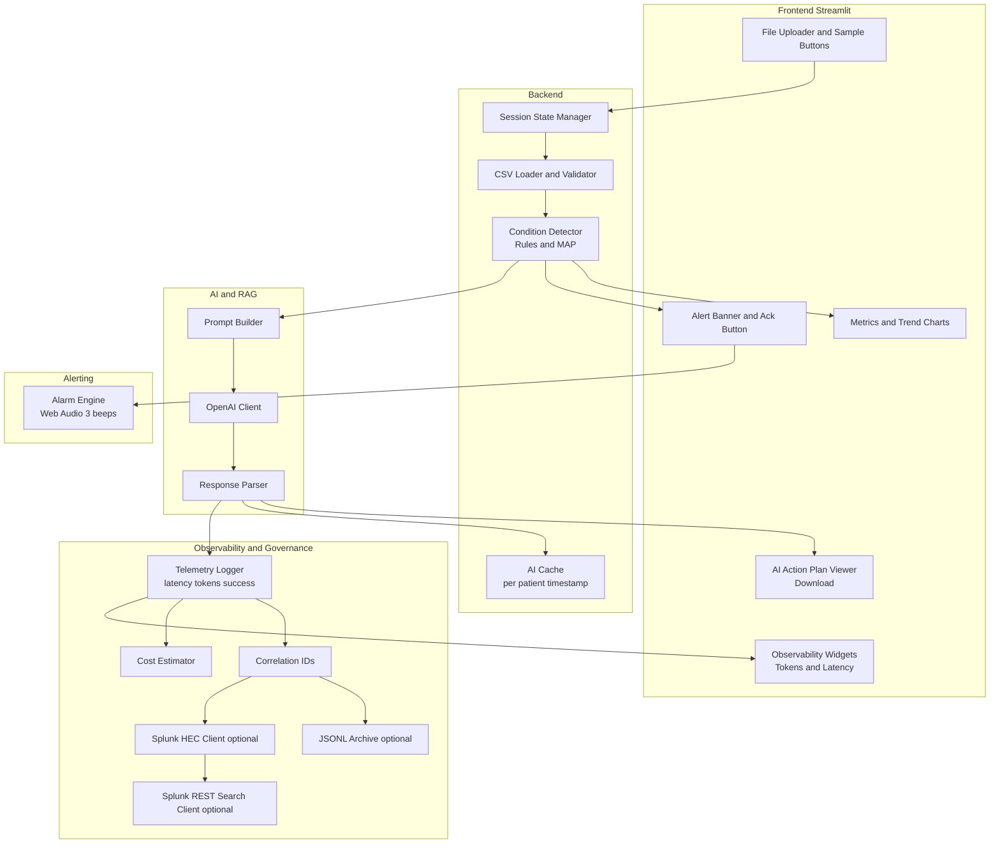
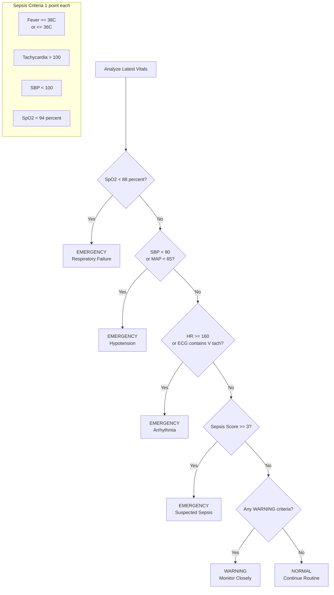

# AI-Based Patient Monitor — Mermaid Diagrams (GitHub-safe)

These diagrams avoid characters that sometimes break GitHub’s Mermaid renderer (parentheses right after a line break, etc.).

---

## 1) High-Level Architecture

---

## 2) End-to-End Data Flow

---

## 3) RAG + Observability Sequence

---

## 4) Component Architecture

---

## 5) Emergency Detection Logic

