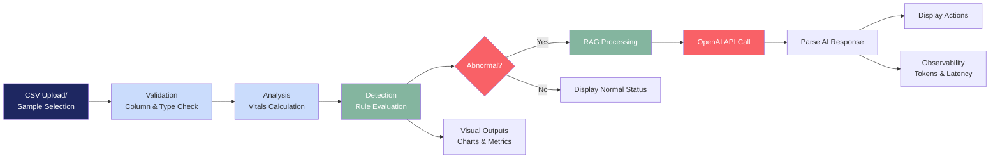
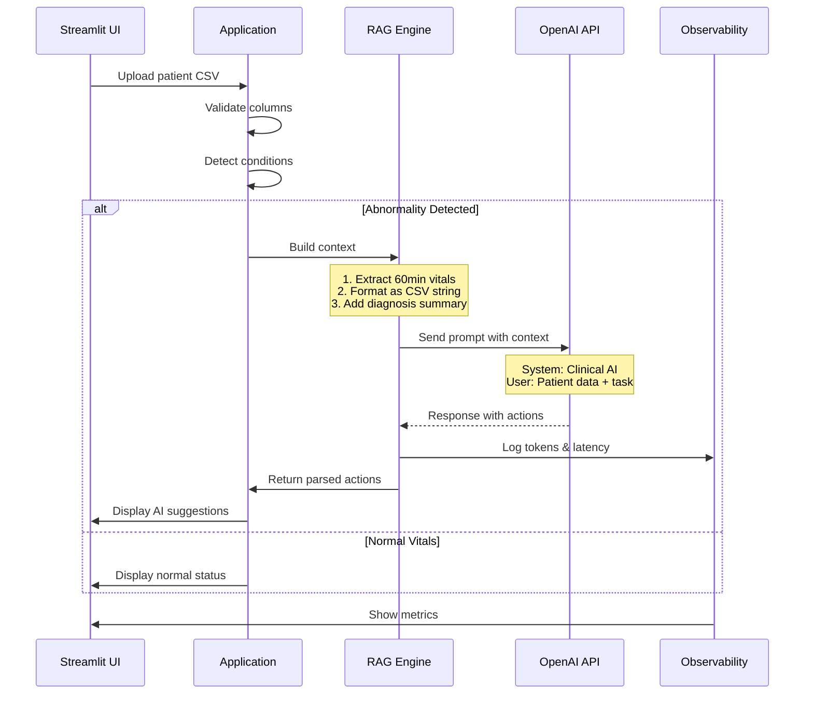
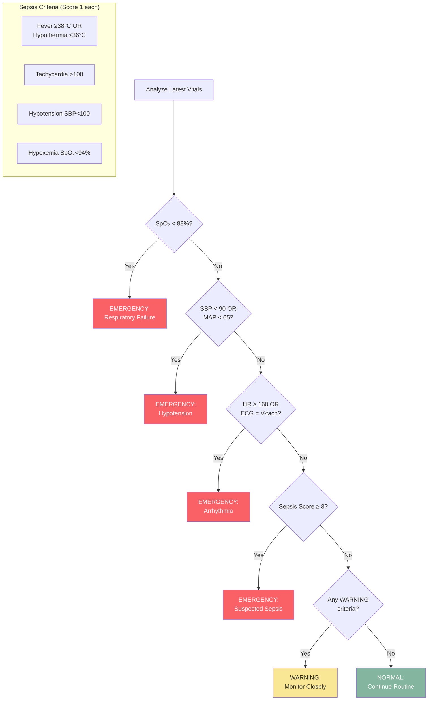

# AI-Based Patient Monitor - Architecture Diagrams

## System Architecture (Mermaid)

### High-Level Architecture

```mermaid
graph TB
    subgraph UI["User Interface Layer"]
        A[Streamlit Web App]
    end
    
    subgraph APP["Application Layer"]
        B[CSV Parser<br/>Pandas]
        C[Clinical Rule Engine<br/>Condition Detection]
    end
    
    subgraph AI["AI/RAG Layer"]
        D[Context Builder]
        E[OpenAI API<br/>GPT-4o-mini]
        F[Response Processor]
    end
    
    subgraph OBS["Observability + Governance Layer"]
        G[Token Tracking]
        H[Latency Monitoring]
        I[Error Handling]
        J[Correlation IDs\n(pm_session_id / pm_run_id)]
        K[Local JSONL Archive]
        L[Splunk HEC Logger]
        M[Splunk REST Run Summary\n(Mgmt API 8089)]
    end
    
    A --> B
    B --> C
    C --> D
    D --> E
    E --> F
    F --> G
    F --> H
    F --> I
    F --> J
    F --> K
    F --> L
    L --> M
    
    style UI fill:#1E2761,color:#fff
    style APP fill:#CADCFC,color:#333
    style AI fill:#84B59F,color:#fff
    style OBS fill:#F96167,color:#fff
```

### Data Flow Pipeline



### RAG Pipeline Detail



### Component Architecture

```mermaid
graph TD
    subgraph Frontend["Frontend Components"]
        A1[File Uploader]
        A2[Metric Cards]
        A3[Alert Banner]
        A6[Alarm Engine\n(Web Audio + Ack Flow)]
        A4[Trend Charts]
        A5[Action Display]
    end
    
    subgraph Backend["Backend Components"]
        B1[Session Manager]
        B2[CSV Parser]
        B3[Condition Detector]
        B4[MAP Calculator]
        B5[AI Cache]
    end
    
    subgraph AI["AI Components"]
        C1[Prompt Builder]
        C2[API Client]
        C3[Response Parser]
        C4[Token Counter]
        C5[Cost Estimator]
    end

    subgraph Gov["Governance / Observability"]
        G1[Correlation IDs]
        G2[Splunk HEC Client]
        G3[Local JSONL Archive]
        G4[Splunk REST Search Client]
    end

    subgraph Alert["Alerting"]
        A6[Alarm Engine\n(Web Audio + Ack Flow)]
    end
    
    subgraph Data["Data Layer"]
        D1[Patient CSV]
        D2[Sample Files]
        D3[Cache Store]
    end
    
    A1 --> B1
    A1 --> D1
    B1 --> B2
    B2 --> B3
    B3 --> B4
    B3 --> C1
    C1 --> C2
    C2 --> C3
    C3 --> C4
    C4 --> C5
    C5 --> G1
    G1 --> G2
    G1 --> G3
    G2 --> G4
    C3 --> B5
    B5 --> D3
    D2 --> B2
    
    style Frontend fill:#1E2761,color:#fff
    style Backend fill:#CADCFC,color:#333
    style AI fill:#84B59F,color:#fff
    style Data fill:#F96167,color:#fff
```

### Emergency Detection Logic



---

## Usage in Documentation

You can embed these Mermaid diagrams in:
- GitHub README.md
- Markdown documentation
- Wiki pages
- Most modern documentation platforms

### Example:
\`\`\`markdown
## Architecture

\`\`\`mermaid
graph TB
    A[User] --> B[App]
    B --> C[AI]
\`\`\`
\`\`\`

---

## Diagram Formats Provided

1. **PowerPoint (.pptx)** - 5 professional slides with colored diagrams
2. **Mermaid (.md)** - 5 diagrams for GitHub/documentation
3. **SVG** - Coming next (vector graphics for high-quality printing)

---

## Color Palette Used

- **Navy (#1E2761)** - User Interface / Primary
- **Ice Blue (#CADCFC)** - Application Layer / Secondary  
- **Sage (#84B59F)** - AI/Success / Positive
- **Coral (#F96167)** - Alerts/Emergency / Attention

These colors create a professional medical/healthcare aesthetic.
