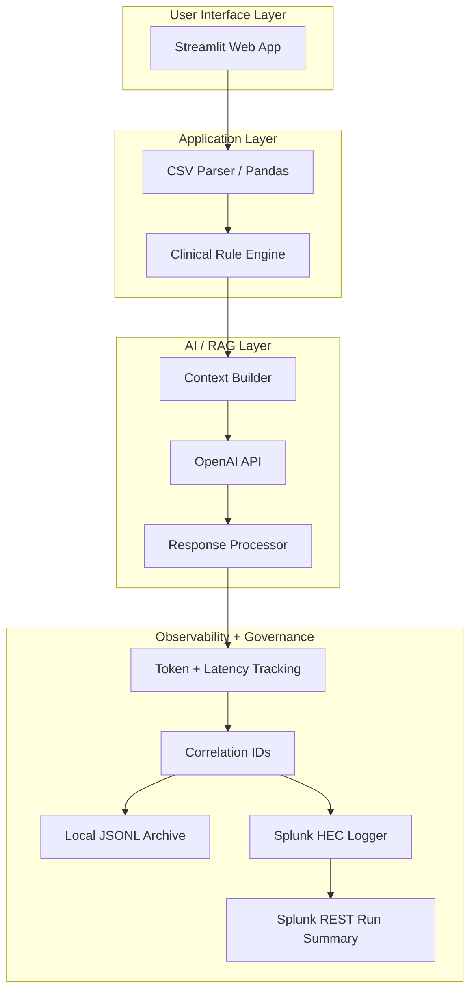

# 🩺 AI-Based Patient Monitor (RAG + Observability + Governance)

An educational ICU patient monitoring prototype built with **Streamlit** that:

- Uses a **deterministic clinical rule engine** (NORMAL → WARNING → EMERGENCY)
- Generates **LLM-assisted nursing actions** using a simple **RAG-style context build** (patient summary + last 60 minutes of vitals)
- Provides **AI observability** (latency, tokens, success/failure, estimated cost)
- Optionally ships events to **Splunk** via **HEC** and can query Splunk via the **Management API (8089)** for run summaries

> ⚠️ Educational prototype only. Not for clinical use.

---

## ✅ Quick Start (Run the App)

### Prerequisites
- **Python 3.10+**
- **pip** installed
- Internet access (only required for LLM calls)

### 1) Install dependencies

**Windows**
```bash
pip install -r requirements_windows.txt
```

**Mac/Linux**
```bash
pip install -r requirements.txt
```

### 2) Set environment variables

#### OpenAI (required for AI actions)
**PowerShell**
```powershell
$env:OPENAI_API_KEY="sk-..."
# Optional (defaults shown):
$env:OPENAI_MODEL="gpt-4o-mini"
$env:OPENAI_BASE_URL="https://api.openai.com/v1"
```

**Mac/Linux**
```bash
export OPENAI_API_KEY="sk-..."
export OPENAI_MODEL="gpt-4o-mini"
export OPENAI_BASE_URL="https://api.openai.com/v1"
```

> If `OPENAI_API_KEY` is not set, the UI still works, but **AI actions are disabled** (graceful degradation).

#### Splunk (optional – observability / governance)
**PowerShell**
```powershell
$env:SPLUNK_HEC_URL="https://localhost:8088/services/collector"
$env:SPLUNK_HEC_TOKEN="YOUR_HEC_TOKEN"
$env:SPLUNK_INDEX="main"
$env:SPLUNK_SOURCETYPE="ai-patient-monitor"

# Optional: local JSONL archive
$env:PM_EVENT_LOG="logs/events.jsonl"

# TLS verify (0 recommended for local demo with self-signed certs)
$env:PM_SPLUNK_VERIFY_TLS="0"
```

**Optional Splunk Management API (8089) – only if you want in-app run summaries**
```powershell
$env:SPLUNK_MGMT_URL="https://localhost:8089"
$env:SPLUNK_USERNAME="admin"
$env:SPLUNK_PASSWORD="changeme"
```

> **Note:** The app is fail-open. If Splunk is not configured, the demo still runs.

### 3) Run Streamlit

The app entry point in this repo is:

```bash
streamlit run er_monitor_app.py
```

Then open:
- `http://localhost:8501`

---

## 🧪 Using the App (Demo Flow)

1. Launch the app
2. In the sidebar:
   - Click **Patient 1 / 2 / 3** to load samples **OR**
   - Upload your own CSV
3. Review:
   - Alert level + diagnosis
   - Trend charts (last 60 min)
   - Explainability (rule triggers)
4. If **EMERGENCY**:
   - The app plays **3 beeps**
   - A flashing banner appears
   - Click **Acknowledge Alert**
5. If abnormal (WARNING/EMERGENCY):
   - The app auto-generates an **AI action plan** (or you can manually re-generate)

---

## 📄 CSV Format

Required columns (must match exactly):

- `patient_id`
- `timestamp`
- `ECG`
- `heart_rate_bpm`
- `temperature_c`
- `bp_systolic_mmHg`
- `bp_diastolic_mmHg`
- `spo2_percent`

Included sample files:
- `patient1_sepsis.csv`
- `patient2_vtach.csv`
- `patient3_respfailure.csv`

---

## 🏗 System Architecture (Mermaid)




---

## 📊 Splunk: Where to See Dashboards, Alerts, and Reports

If Splunk is configured, the app sends events (HEC) with fields such as:
- `event_type`: `ai_inference`, `clinical_alert`, `alert_acknowledged`
- `alert_level`, `diagnosis`, `latency_ms`, `tokens_total`, `estimated_cost_usd`
- `pm_session_id`, `pm_run_id` (correlation)

### 1) Splunk Search (verify data is coming in)
In Splunk Web, open:
- **Apps → Search & Reporting**

Run:
```spl
index=main sourcetype="ai-patient-monitor"
| sort - _time
| head 50
```

### 2) Suggested “Dashboard Panels” (you can save these)
In **Search & Reporting**, run each search and click:
- **Save As → Dashboard Panel** (or **Save As → Report**)

**AI calls + success rate**
```spl
index=main sourcetype="ai-patient-monitor" event_type="ai_inference"
| eval s=if(success=1 OR success="true",1,0)
| stats count as ai_calls sum(s) as successes
| eval success_rate=round(100*successes/ai_calls,2)
```

**Latency**
```spl
index=main sourcetype="ai-patient-monitor" event_type="ai_inference"
| stats avg(latency_ms) as avg_latency_ms p95(latency_ms) as p95_latency_ms max(latency_ms) as max_latency_ms
```

**Token usage + estimated cost**
```spl
index=main sourcetype="ai-patient-monitor" event_type="ai_inference"
| stats sum(tokens_total) as tokens_total sum(estimated_cost_usd) as est_cost_usd
```

**Clinical emergencies**
```spl
index=main sourcetype="ai-patient-monitor" event_type="clinical_alert" alert_level="EMERGENCY"
| timechart count as emergency_count
```

### 3) Alerts (optional)
To create an alert:
- In **Search & Reporting**, run a search (example below)
- Click **Save As → Alert**
- Choose schedule + trigger conditions

Example: alert when emergencies occur
```spl
index=main sourcetype="ai-patient-monitor" event_type="clinical_alert" alert_level="EMERGENCY"
| stats count as c
```

Trigger condition:
- **c > 0**

### 4) Reports (optional)
To create a report:
- **Save As → Report**
- Choose a schedule if desired (daily/weekly)

Example: daily AI usage report
```spl
index=main sourcetype="ai-patient-monitor" event_type="ai_inference"
| timechart span=1d sum(tokens_total) as tokens sum(estimated_cost_usd) as cost
```

---

## 📂 Updated Architecture Files (Included)

- 📊 `AI_Architecture_Diagrams.pptx`
- 📝 `ARCHITECTURE_MERMAID.md`
- 📘 `ARCHITECTURE_GUIDE.md`

---


---

## 🚀 Run The Program Locally - Docker Setup - (One Command Setup)

### Prerequisites

* Docker Desktop installed
* Docker Desktop running

---

### 1️⃣ Clone Repo

```bash
git clone <your-repo-url>
cd ai-based-patient-monitor-application
```

---

### 2️⃣ Start Everything

```bash
docker compose up -d --build
```

---

### 3️⃣ Access Services

* 🧠 Streamlit App → [http://localhost:8501](http://localhost:8501)
* 📊 Splunk Web → [http://localhost:8000](http://localhost:8000)

Login:

```
Username: admin
Password: (see .env file SPLUNK_PASSWORD)
```

---

### 4️⃣ Verify HEC (Optional Smoke Test)

```powershell
$token = (Get-Content .\.env | Select-String "^SPLUNK_HEC_TOKEN=" | % { $_.Line.Split("=")[1].Trim() })
@'
{"event":"hec-smoke-test","sourcetype":"ai-patient-monitor","index":"main"}
'@ | Set-Content -Encoding ascii .\hec_test.json

curl.exe -k https://localhost:8088/services/collector `
  -H "Authorization: Splunk $token" `
  -H "Content-Type: application/json" `
  --data-binary "@hec_test.json"
```

Search in Splunk:

```spl
index=main sourcetype=ai-patient-monitor "hec-smoke-test"
```

---

### 5️⃣ Stop

```bash
docker compose down
```

---

## 🛡 Security Notes

- Uses **environment variables** for secrets (recommended)
- No API keys stored in code
- Fail-open Splunk logging (does not break demo)
- Graceful degradation if OpenAI API key is missing
- No secrets committed
- .env excluded via .gitignore
- Uses environment variables for configuration
- Local demo disables TLS verification for self-signed HEC cert
---

---
🧠 Design Decisions
- Docker Compose enables reproducible grading
- HTTPS HEC integration for realistic ingestion pipeline
- Observability-first architecture (AI telemetry to Splunk)
- Infrastructure as Code mindset
---

## 🚀 Author

Zafar Adil — AI Practitioner Crash Course (Assignment #8)

---

## 📌 Version

v2.0 – Observability + Governance Edition
v3.0 – Dockerized Observability Edition

---

# 📊 Architecture Diagram

Download your clean submission-ready PNG here:

👉 **Download this file and place it inside `/docs/`**

[Download ARCHITECTURE_DIAGRAM.png](sandbox:/mnt/data/ARCHITECTURE_DIAGRAM.png)

Then commit:

```bash
git add docs/ARCHITECTURE_DIAGRAM.png
git commit -m "Add final architecture diagram"
git push


